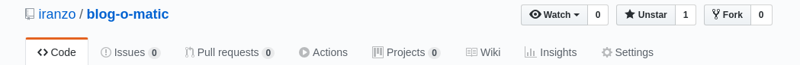
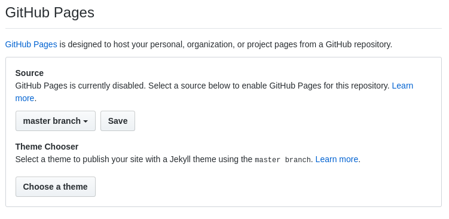
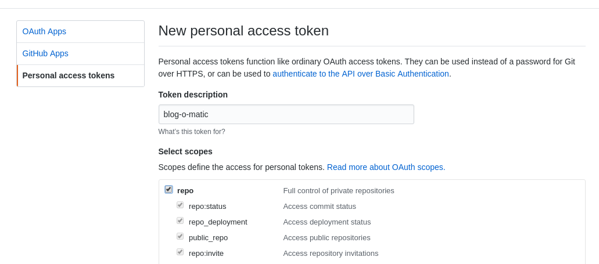
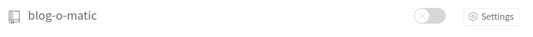
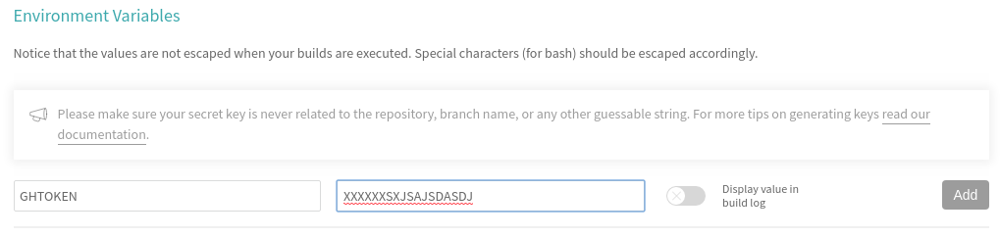
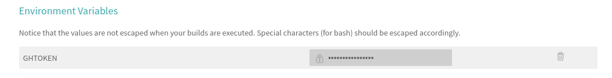

# blog-o-matic by Pablo Iranzo

**Table of contents**
<!-- TOC depthFrom:2 insertAnchor:false orderedList:true updateOnSave:true -->

1. [Introduction](#introduction)
2. [Setup](#setup)
3. [Test it](#test-it)
4. [WARNING](#warning)
5. [Going the extra mile](#going-the-extra-mile)
6. [Feedback and wrap up](#feedback-and-wrap-up)

<!-- /TOC -->

## Introduction

The Idea with this repository, is to have an easy an 'automated' setup of a blog on github pages by following some easy instructions.

You'll need to setup several steps manually (sorry, I can't do that for you), but once done, each time you publish a new article (markdown, asciidoc), the blog will be redeployed showing your new one.

Blog will be using:

- Git Hub pages for the hosting of the sources and repository
  - Git Hub token to publish new 'website' once a new article is uploaded
- [travis-ci.org](https://travis-ci.org) for automating the update and generation process
- ['pelican'](https://blog.getpelican.com/) for static rendering of your blog from the markdown or asciidoc articles
- ['Elegant'](https://github.com/Pelican-Elegant/elegant) for the 'Theme'
- [peru](https://github.com/buildinspace/peru) for automating repository upgrades for plugins, etc

## Setup

- Fork this repository to your github account, if this is your first 'blog', name it `username.github.io` if not, it will be published as `username.github.io/repository`
  - Visit `settings' on your new cloned repository:
    
    - Enable GitHub Pages on the 'master' branch:
        
      - Validate that the URL now works (<https://iranzo.github.io/blog-o-matic/>)
- Generate a [github token](https://github.com/settings/tokens/new) for your account and save securely the value obtained:
  
- Go to [travis-ci.org](https://travis-ci.org/) and login with your github account.
  - Enable repository builds:
      
  - And click on 'settings' once done, and define a new environment variable named `GHTOKEN` with the value obtained in the prior step
      
    - Click on 'ADD' once done:
        
      - Token will now be saved and ready for use
- Clone the resulting repository to your system, for example:
  - `git clone https://github.com/iranzo/blog-o-matic.git`
  - change to the `source` branch that will contain the code that we'll be using for updating the website.

- Edit new articles in `content/` based on the one already provided.

## Test it

As of this step, your repository should be already published on <https://githubusername.github.io/> with the 'sample' content

Once you've written your new article in 'content' folder, perform:

~~~sh
## Add file to repository
git add content/new-article-filename

## Add file to commit
git commit -m "My new article"

## Upload changes to github
git push
~~~

After some seconds, <https://travis-ci.org> will start showing that a new build is in progress, and once it finishes successfully, the resulting webpage will be available via your `username.github.io` domain.

## WARNING

- `peru.yaml` is set to use `next` branch of Elegant theme for pelican, as this setup uses pelican 4.0 and current 'master' doesn't work for it (feed slugs related)
  - Remember to update the file or check master blog-o-matic from time to time to see when you should update it <https://github.com/iranzo/blog-o-matic/issues/1>

## Going the extra mile

- Elegant does generate a sitemap to submit to web crawlers to ease indexing
  - `YOURURL/sitemap.xml` can be submitted
  - [Google Search Console](https://search.google.com/search-console/)
    - Will require you to claim the website as yours, for doing so:
      - Download Google claiming HTML to a folder
      - `git mv content/extra/google3bc953001343abe6 content/extra/googleYOURHEXA` (without `.html`)
      - Overwrite resulting file above with contents of the downloaded one
      - customize `pelicanconf.py` to match the HEXA you received, in the line that says:
        - `'extra/google3bc953001343abe6': {'path': 'google3bc953001343abe6.html'},`
  - [Bing Webmaster](https://www.bing.com/webmaster/)
    - Overwrite the file `content/extra/BingSiteAuth.xml` with the file you received
- Review other settings in `pelicanconf.py` to customize your blog name, your name, twitter handle, google analytics ID or others, please do check [Pelican-Elegant documentation](https://pelican-elegant.github.io) for more information on what can be done.

## Feedback and wrap up

- For saying thanks: <https://paypal.me/iranzop>
- For issues: <https://github.com/iranzo/blog-o-matic/issues/>
- For other things I've done: <https://iranzo.github.io>
